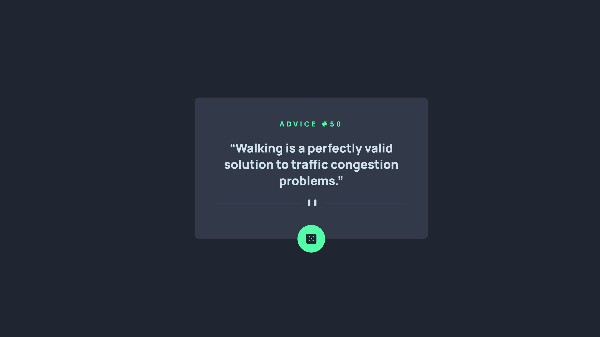

# Frontend Mentor - Advice generator app solution

This is a solution to the [Advice generator app challenge on Frontend Mentor](https://www.frontendmentor.io/challenges/advice-generator-app-QdUG-13db). Frontend Mentor challenges help you improve your coding skills by building realistic projects.

## Table of contents

- [Overview](#overview)
  - [The challenge](#the-challenge)
  - [Screenshot](#screenshot)
  - [Links](#links)
- [My process](#my-process)
  - [Built with](#built-with)
  - [What I learned](#what-i-learned)
- [Author](#author)

## Overview

### The challenge

Users should be able to:

- View the optimal layout for the app depending on their device's screen size
- See hover states for all interactive elements on the page
- Generate a new piece of advice by clicking the dice icon

### Screenshot



### Links

- Solution URL: [Front End Mentor](https://www.frontendmentor.io/solutions/advice-generator-app-using-sass-060ZbZcPqh)
- Live Site URL: [Vercel](https://fem-advice-generator-app-drab.vercel.app/)

## My process

### Built with

- Flexbox
- Mobile-first workflow
- [Sass](https://sass-lang.com/) - CSS Preprocessors

### What I learned

```css
/* CSS */
@media (pointer: coarse) {
  // styles to target touch devices
}

@media (pointer: fine) {
  // styles to target non-touch devices
}
```

```js
// JavaScript
async function someFunction() {
  const response = await fetch(url, {
    mode: "cors",
  });
  const data = await response.json();
}
```

```scss
// Sass
$variable: white;

.parent {
  //...
  & .child {
    //...
  }
}
```

## Author

- Website - [El Bhiruni](https://github.com/elbhiruni)
- Frontend Mentor - [@elbhiruni](https://www.frontendmentor.io/profile/elbhiruni)
